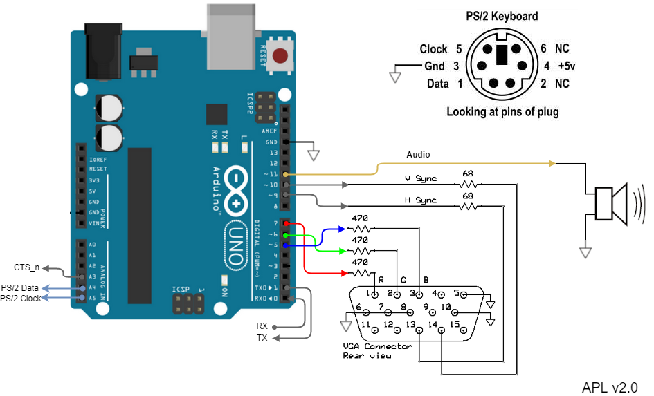

# APL – Arduino Peripheral Library

COPYRIGHT (C) 2020 Adrian Kundert  
[adrian.kundert@gmail.com](mailto:adrian.kundert@gmail.com)  

# Introduction:

The APL development begun with an hobbyst project having as goal to design a single board computer with audio-video and PS/2 keyboard interfaces. Such open source implementations are already realized by other ATMEL programmers like [Nick Gammon](http://www.gammon.com.au/) and [Sandro Maffiodo](https://github.com/smaffer). Since every design is a resource tradeoff and my features priorization were different I came out with a different implementation. Indeed the VGA resolution was important but I wanted to keep the UART port available for communication and also use as less as possible RAM. For this I had to store the data in the PGM memory and trade the color to monochrome because reading from RAM is slower.

# Features Overview:

- Timer Interrupt based implementation (execution not impacted by the main loop)
- Low RAM footprint by tile rendering from PGM memory (4 clocks / pixel)
- Tile size is 6 px by 8 px (character mode) or 10 px by 10 px (graphic mode)
- Fast screen scrolling by tile index
- Optional hardware pixel multiplexer to increase the resolution (3 clocks / pixel)
- [PS/2 keyboard](https://www.arduinolibraries.info/libraries/ps2-keyboard) support
- Sound Tone from 45 Hz to 12 KHz
- SD card interface (TBD)

The APL is designed for Arduino software development environement. The hardware configuration is flexible from standart board like Arduino Uno or Nano, but can also be customized with an higher system clock for better performance. Additionally, an external pixel multiplexer circuit can be added to increase even more the pixel resolution.

| Configuration | Tile Resolution in Character mode | Tile Resolution in Graphic mode | Pixel Resolution (width by height) |
| --- | --- | --- | --- |
| 16 MHz (Uno/Nano) | 11 (15) | 8 (11) | 64x160 (88x160) |
| 24 MHz | 22 (29) | 16 (21) | 128x160 (168x160) |
| 32 MHz (experimental) | 31 (42) |  21 (31) | 168x160 (248x160) |

# Demo

## Font (character mode)

## Pong (graphic mode)

# Hardware Configuration

## Arduino Uno/Nano board configuration (16 MHz)

### Bread board configuration (system clock up to 20 MHz and even more)

### Hardware pixel multiplexer (system clock up to 20 MHz and even more)

# Installation

1. Import the APL library in your Arduino library folder: menu Sketch -> Include library -> add .ZIP Library
2. Open the demo application "Font" or "Pong" with Arduino IDE
3. (if required) in APLcore.h change the sys clock and Pixel_Mux definition:

	#define F_CPU 16000000UL  // system clock
	
	#define PIXEL_HW_MUX      // enable this define when Pixel Hardware Mux is used
	
4. Verify and Program your device
