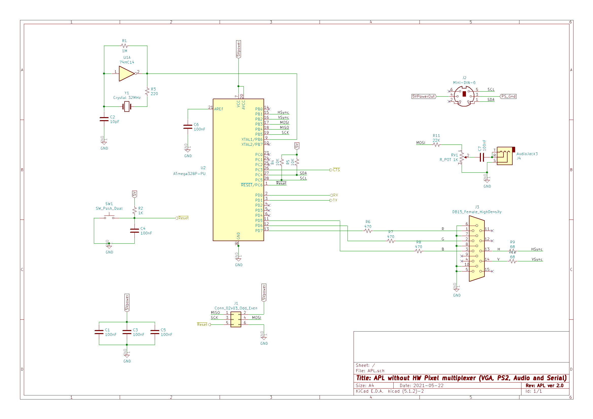

# APL v2.0 – Arduino Peripheral Library

COPYRIGHT (C) 2018-2021 Adrian Kundert  
[adrian.kundert@gmail.com](mailto:adrian.kundert@gmail.com)  

# Introduction:

The APL development begun with an hobbyst project having as goal to design a single board computer with audio-video and PS/2 keyboard interfaces. Such open source implementations are already realized by other Atmel programmers like [Nick Gammon](http://www.gammon.com.au/) and [Sandro Maffiodo](https://github.com/smaffer). Since every design is a resource tradeoff and my features priorization were different I came out with a different implementation. Indeed the VGA resolution was important but I wanted to keep the UART port available for communication and also use as less as possible RAM. For this I had to store the data in the PGM memory and limit to monochrome because reading from RAM is slower. The color is still possible by adding an external multipler circuit.

# Features Overview:

- Timer Interrupt based implementation (execution not impacted by the main loop)
- Low RAM footprint by tile rendering from PGM memory (4 clocks / pixel)
- Tile size is 6 px by 8 px (Text mode) or 8 px by 8 px (GraphicPgm and Graphic modes)
- Runtime tile creation for the Graphic mode with tiles allocated in the RAM
- Fast screen horizontal and vertical pixel scrolling for the GraphicPgm and Graphic modes
- Optional hardware pixel multiplexer for RGB capability
- [PS/2 keyboard](https://www.arduinolibraries.info/libraries/ps2-keyboard) support
- Sound Tone from 45 Hz to 12 KHz
- SD card interface (TBD)

The APL is designed for Arduino software development environement. The hardware configuration is flexible from standart board like Arduino Uno or Nano,

| Configuration | Pixel height)| Tile Resolution in Text mode (Pixel width) | Tile Resolution in GraphicPGM mode (Pixel width)| Tile Resolution in Graphic mode (Pixel width)|
| --- | --- | --- | --- |
| 32 MHz (experimental) | 160 | 29 (172) |  19 (152) | 17 (136) |
| 24 MHz | 160 | 19 (114) | 13 (104) | 11 (88) |
| 16 MHz (Uno/Nano) | 160 | 8 (48) | 6 (48) | 4 (32) |

but can also be customized with an higher system clock for better performance. Additionally, an external pixel multiplexer circuit can be added to increase even more the pixel resolution.

| Configuration | Pixel height)| Tile Resolution in Text mode (Pixel width) | Tile Resolution in Graphic mode (Pixel width)|
| --- | --- | --- | --- |
| 32 MHz (experimental) | 160 | 29 (172) |  21 (168) |
| 24 MHz | 160 | 20 (120) | 14 (112) |

# Demo

## Font (Text mode)

## Pong (GraphicPGM mode) and Scolling (Graphic mode)

## Sokoban (GraphicPGM mode)

# Hardware Configuration

## Arduino Uno/Nano board configuration (16 MHz)

### Bread board configuration (system clock up to 20 MHz and even more)

### Hardware pixel multiplexer (system clock up to 20 MHz and even more)

# Atmel Studio 7 Installation

1. Having installed Atmel Studio 7
2. Open the solution file "APL.atsln" for the demo application "Font" or "Pong" or "Sokoban"
3. (if required) in config.h change the sys clock and Pixel_Mux definition:

	#define F_CPU 16000000UL  // system clock
	
	#define PIXEL_HW_MUX      // enable this define when Pixel Hardware Mux is used
	
4. Build and Program your device

# Arduino IDE Installation

1. Having installed Arduino IDE version 1.8.10 or newer
2. Import the APL library in your Arduino library folder: menu Sketch -> Include library -> add .ZIP Library
3. Open the demo application "Font" or "Pong" or "Sokoban" with the Arduino IDE
4. (if required) in APLcore.h and config.h change the sys clock and Pixel_Mux definition:

	#define F_CPU 16000000UL  // system clock
	
	#define PIXEL_HW_MUX      // enable this define when Pixel Hardware Mux is used
	
5. Verify and Program your device
